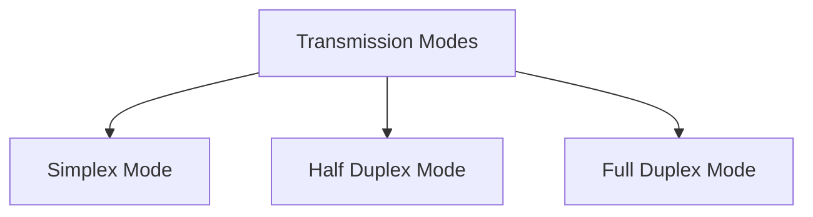

# Goals of Computer Networking
1. Facilitating Communication
2. Resource sharing
3. Data Storage and access
4. Cost Efficiency
5. Reliability and Redundancy
# Components of Data Communication
1. **Message:** 
2. **Sender:**
3. **Receiver:**
4. **Transmission Medium:**
5. **Protocol:** syntax, semantics, timing, De facto, De jure

![[Screenshot 2024-01-04 at 6.31.58 PM.png]]

---
# Transmission Modes

## Simplex Mode
- unidirectional
- can use entire capacity of the channel
- **Eg:** radio, mouse

## Half Duplex
- Each station can both **Transmit** and **receive** but *not at same time*
- **Eg:** walkie - talkies
- entire capacity of channel is taken by whichever of the 2 device is Transmitting at that time

## Full Duplex
- Both stations can transmit and receive at the same time
- capacity of the channel must be divided between 2 directions
- **Eg:** Telephone

---
# Network Criteria
1. **Delivery & Accuracy**
2. **Performance:** transit time, response time, number of users, type of transmission medium, capabilities of connected hardware, efficiency of software
3. **Reliability**
4. **Security**

# Types of Connection
1. Point to Point
2. Multipoint

# Physical Topology

![[Screenshot 2024-01-04 at 6.47.23 PM.png]]

## 1. Point to point
## 2. Bus
- multipoint
- 1 long cable acts as a backbone to link all devices in the network
- nodes are connected to the bus cable by drop lines and taps
- **Drop line** --> connection running between device and main cable
- **Tap** --> connector that *either* splices into main cable *or* puncture the sheathing of cable to create a contact with  the metallic core
- **Advantage**
	- Easy installation
	- Use less cabling than **Mesh** or **Star**
- **Disadvantages**
	- Difficult reconnection and fault isolation
	- Difficult to add new devices to network
	- A fault or break in the bus cable stops all transmission

## 3.  Ring
- each device has a dedicated p2p connection with only 2 devices on either side of it
- signal is passed along in 1 direction from device to deice until it reaches destination
- each device act as a repeater
- **Advantages**
	- easy to install and reconfigure
	- fault isolation is simplified
- **Disadvantages**
	- a break in the ring can disable the entire network

## 4. Star
- each device has a dedicated p2p link only to a central controller called **HUB**
- devices are not directly linked to one another
- HUB relays data to other connected devices
- **Advantages**
	- Less expensive than *MESH*
	- easy to install and reconfigure
	- Robust --> if 1 link fails, only that link is affected
	- Easy fault identification and fault isolation
- **Disadvantages**
	- Dependency of whole topology on 1 single point **HUB**
	- More cabling required than other topologies

## 5. Tree
## 6. Mesh
- every device has a dedicated p2p link to every other deice
- we need **n(n-1)/2** duplex node links, *n = number of nodes*
- **Advantages:**
	- No traffic problem
	- Robust
	- Privacy or security
	- Fault identification and fault isolation is easy
- **Disadvantages**
	- installation and reconnecting are difficult
	- sheer bulk of wiring
	- expensive
## 7. Hybrid

---
![[Screenshot 2024-01-04 at 7.57.24 PM.png]]

# Local Area Network (LAN)
- limited to few km
- maybe privately owned --> n/w of computers inside a building

# Wide Area Network (WAN)
- cover a geographic area

# Metropolitan Area Network (MAN)
- size -- > LAN < MAN < WAN
- n/w in a city

---
# OSI (Open system interconnect)
- proposed by ISO
- allow 2 systems to communicate regardless of their architecture
- ~~protocol~~ 

![[Screenshot 2024-01-04 at 8.02.50 PM.png]]

![[Screenshot 2024-01-04 at 8.03.26 PM.png]]

---
# Layered Architecture
1. **Peer-to-peer process:** processes on each machine that communicate at a give layer

![[Screenshot 2024-01-04 at 8.07.10 PM.png]]

Flow

![[Screenshot 2024-01-04 at 8.08.08 PM.png]]

---
# 1. Physical Layer

![[Screenshot 2024-01-04 at 8.39.09 PM.png]]

- Defines **characteristics of interface** between the devices and transmission medium

## 1. Representation of BITS
- physical layer data consist of stream of bits
 ![[Screenshot 2024-01-04 at 8.40.55 PM.png]]

## 2. Data rate
- transmission rate of number of bits sent each second is also defined in `Physical Layer`

![[Screenshot 2024-01-04 at 8.44.29 PM.png]]

## 3. Line Connection
- p2p, multipoint
- physical layer is concerned with connection of devices to the media

## 4. Physical topology
- p2p, bus, ring, star, mesh, tree, hybrid

## 5. Tranmission Mode
- defines direction of transmission between 2 devices ---> `simple` , `Half-duplex`, `Full - Duplex`

---
# 2. Data Link Layer

## 1. Framing
- divides stream of bits received from network into manageable data units called `frames`

![[Screenshot 2024-01-04 at 8.50.35 PM.png]]

## 2. Physical Addressing
- adds **Header** to the frame to define **sender/receiver** of the frame for distribution to different systems on the n/w

![[Screenshot 2024-01-04 at 8.51.31 PM.png]]

## 3. Access Control
- when 2 or more devices are connected to same link
- helps to determine which device has control over the link at the give time

![[Screenshot 2024-01-04 at 8.54.55 PM.png]]

## 4. Flow Control
- if the rate at which data is absorbed by the receiver is less than rate at which data is produced by the sender ---> **FLOW mechanism** to avoid overwhelming the receiver

 ![[Screenshot 2024-01-04 at 8.55.43 PM.png]]

## 5. Error Control
- adds reliability to PHYSICAL LAYER by adding mechanism to **detect and retransmit** damaged or lost frames
- offers mechanism to **detect duplicate frames**
- achieved through a trailed added to the end of the frame

![[Screenshot 2024-01-04 at 9.00.01 PM.png]]

---
# 3. Network Layer
- responsible for **source-to-destination delivery** of a packet across multiple networks (links)

![[Screenshot 2024-01-04 at 9.00.58 PM.png]]

## 1. Logical Addressing
- if a packet passes the n/w boundary, we need another addressing system to help distinguish source and destination system
- `Network Layer` adds **HEADER** to the packet coming from upper layer which includes the logical address of the sender and receiver

![[Screenshot 2024-01-04 at 9.05.54 PM.png]]

## 2. Routing
- when independent networks or links are connected to create inter-networks or a large network, the connecting devices (routers or switches) route or switch the packet to their final destination.

![[Screenshot 2024-01-04 at 9.06.45 PM.png]]

